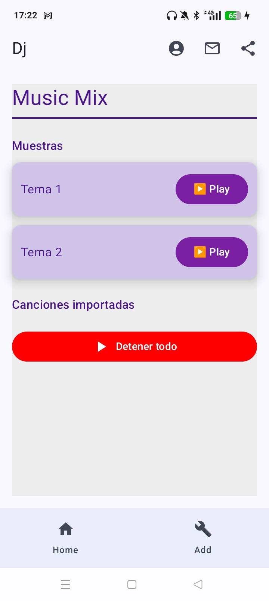

# 🎛️ Mesa de Mezclas — Jetpack Compose

**Mesa de Mezclas** es una aplicación móvil para mezclar canciones y efectos de sonido de manera interactiva, creada como proyecto de aprendizaje con **Jetpack Compose**.  
Permite al usuario reproducir canciones fijas, cargar canciones desde el móvil, y mezclar varias pistas de audio simultáneamente.

---

## Funcionamiento

El usuario puede:

- Reproducir canciones fijas predefinidas desde los recursos de la app.  
- Agregar canciones desde el dispositivo móvil a la lista de reproducción.  
- Reproducir varias canciones a la vez, controlando la reproducción individual de cada una.  
- Detener todas las canciones con un solo botón.  

---

## UI

Se os proporciona un proyecto base con parte de la interfaz ya diseñada.  
Vuestra tarea es que la **interfaz gráfica** se parezca a las capturas de pantalla proporcionadas, incluyendo:

- Cards para cada canción con botón **Play/Pausa**.  
- Separación visual entre canciones fijas y móviles.  
- Botón para **detener todas las canciones**.
- Ventana para cargar canciones desde el movil.

---
### Capturas de la app

---

---

## Estructura de proyecto

El proyecto consta de los siguientes paquetes: `navigation`, `screen` y `viewmodel`:

- **MainActivity.kt**

- **AppNavigation.kt**  
  Crear la estructura de la aplicación, incluyendo una barra superior con botones funcionales y navegación entre pantallas.  

  **En la barra superior podéis incluir funcionalidades como:**  
  1. Mandar un email al desarrollador.  
  2. Enlace a GitHub.  
  3. Compartir un mensaje en WhatsApp u otra app.  

  **En la barra inferior:** navegación entre ventanas con iconos correspondientes.

- **MixScreen.kt**  
  Pantalla principal donde se muestran todas las canciones (fijas y del móvil).  
  Cada canción aparece en una **Card** con:  
  - Nombre de la canción  
  - Botón Play/Pausa 
  - Botón general para detener todas las canciones

- **SelectScreen.kt**  
  Ventana para seleccionar canciones desde el dispositivo móvil.  
  Incluye un botón “+” que abre el explorador de archivos para elegir un audio.

- **GameViewModel.kt**  
  Se encarga de manejar la lógica de reproducción de las canciones, controlando:  
  - MediaPlayer por cada canción  
  - Estado de reproducción (Play/Pausa)  
  - Agregar canciones del móvil a la lista

---

## Entrega

- Proyecto completo en **GitHub**.  
- Debe compilar correctamente y funcionar sin errores.  
- Se valorará la coherencia visual y el uso correcto de los componentes de **Jetpack Compose**.
